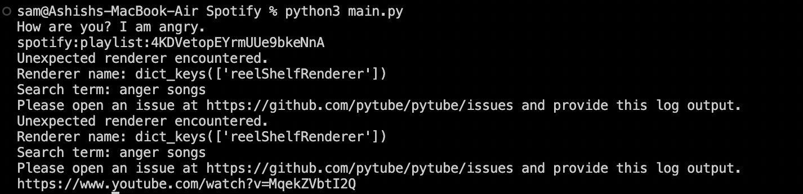
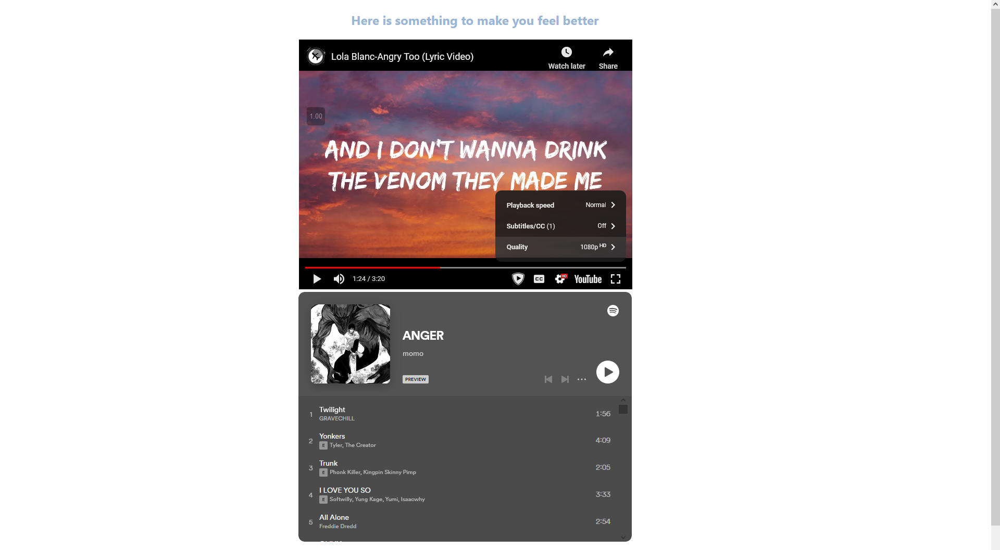

# NYIT's United Engineering Hackathon

**Location**: 16W 61st St.

**Schedule**: 04/08/23, 9:30 AM to 6:30 PM (coding was from about 10:30 AM to 5:00 PM).

**Timeline**:

- I went into this hackathon on my own and found a group that were in a similar situtation to me. 

- As we were all participating on the "hard" track, the goal was to create a full-stack application that uses artificial intelligence to create a technology-based solution to a problem (without using aritifical intelligence such as ChatGPT, of course). 

- The back-end is able to successfully detect a user's input, determine it's emotional index (EmoDex API), and output a Spotify playlist and YouTube music video based off of that (using the Spotipy & PyTube APIs, respectively). 

- The front-end is able to embed YouTube videos and Spotify playlists, but since we were unable to retrieve the links we had gotten through Python, it meant we couldn't dynamically display this embed. Ultimately, due to time constraints, we were unable to link the back-end and front-end succesfully. 

- We attempted to use Flask and PyScript to attempt to incorporate Python and HTML together, but again, due to time constraints, we were unable to make it work. 

- Overall, the project is very close to working flawlessly, but needs a way to transfer the data from the Python files to the HTML.

 

**Python Terminal Output**:

 

**Potential Front-End Output**: 

